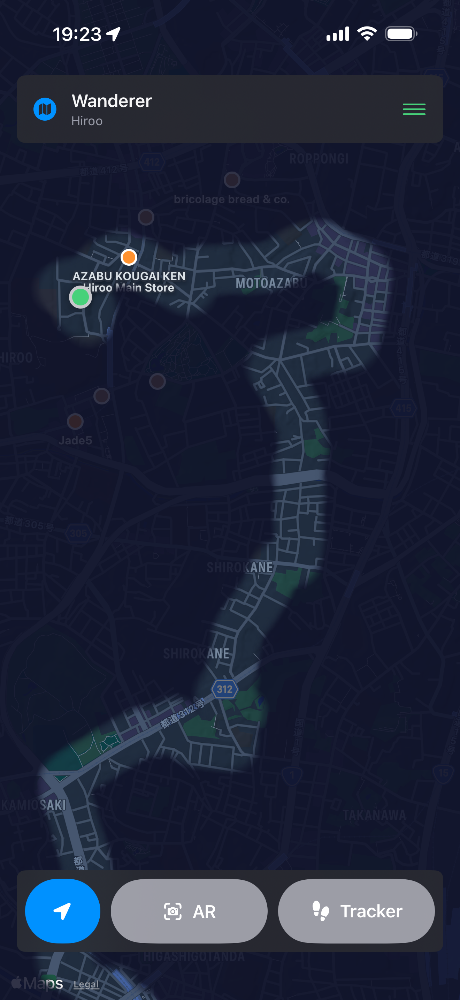
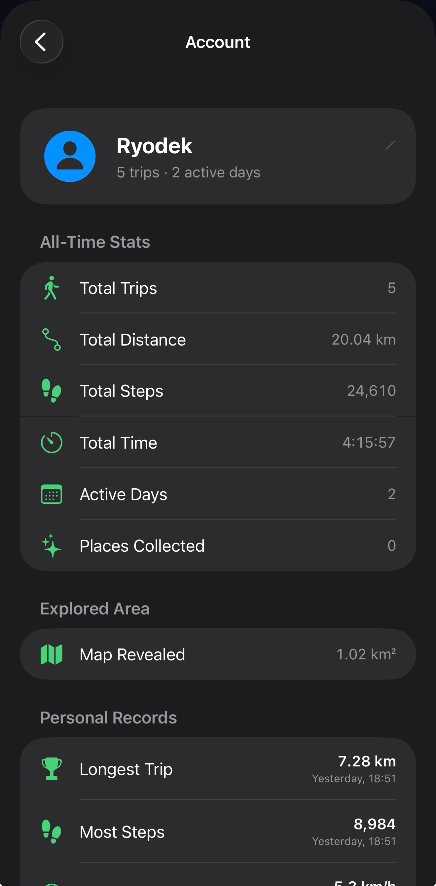

# Wanderer

**Explore the world one step at a time.**

  
  

Wanderer is a native iOS app for walking exploration: track trips, peel back a fog-of-war map as you move, discover nearby places, and collect them in AR.

---

## Features

### Trip tracking
- Start a walk and record GPS path, steps, distance, average speed, and elapsed time
- Manual pause/resume, plus automatic pause when you’re not moving
- Background location so an active trip can keep recording when the app isn’t open
- **Live Activity** on the Lock Screen and Dynamic Island (steps, time, distance)

### Fog of war
- The map starts veiled; walking reveals the world around you
- Revealed area is persisted and summarized (e.g. km² explored)

### Nearby places & AR collection
- Finds restaurants, cafés, and attractions near you (MapKit)
- **AR mode** places pixel-art markers over the real world so you can collect them
- Simulator-friendly fallback when camera AR isn’t available
- Saved collection of places you’ve collected

### Trip recaps
- Animated path replay on a map after each trip
- Name and notes for each walk
- Photos taken near the route (Photo Library), selectable for the recap
- Full trip history with daily activity stats

### Areas & account
- Reverse-geocoded neighborhoods/localities you’ve visited
- All-time stats: trips, distance, steps, time, active days, places collected
- Personal records (longest walk, most steps, etc.)

### Settings
- Map style: Standard, Satellite, or Hybrid
- Units: metric or imperial

All data stays on device (JSON under the app Documents directory). No account or backend required.

---

## Requirements

| | |
| --- | --- |
| **Xcode** | Recent Xcode with iOS 26 SDK support |
| **iOS** | Deployment target **26.5** (see project settings) |
| **Device** | iPhone (location + motion; camera for AR) |
| **Language** | Swift / SwiftUI |
| **Dependencies** | Apple frameworks only |

**Frameworks used:** MapKit, CoreLocation, CoreMotion, ARKit, RealityKit, ActivityKit, WidgetKit, Photos, Observation

---

## License

This project is licensed under the [MIT License](LICENSE).

Copyright © 2026 Julien Delezenne
